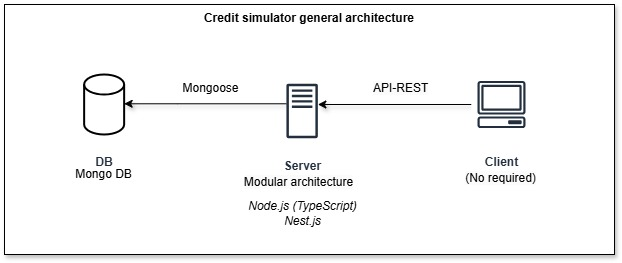
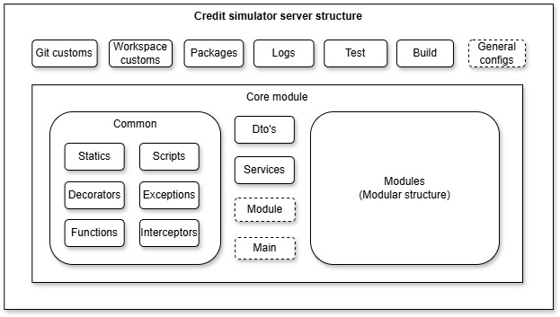
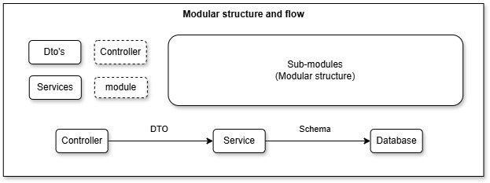
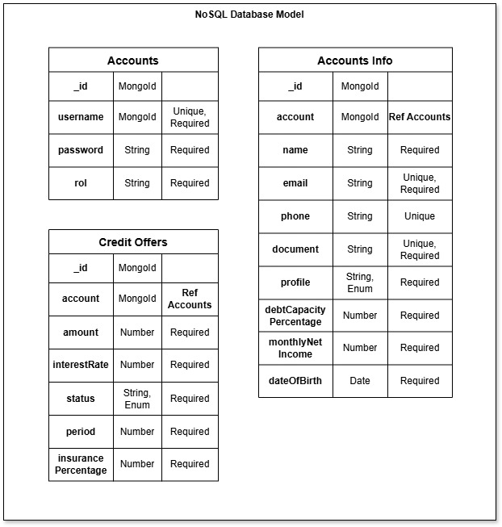
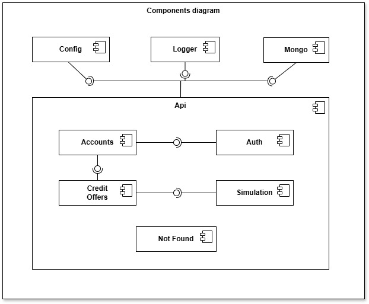
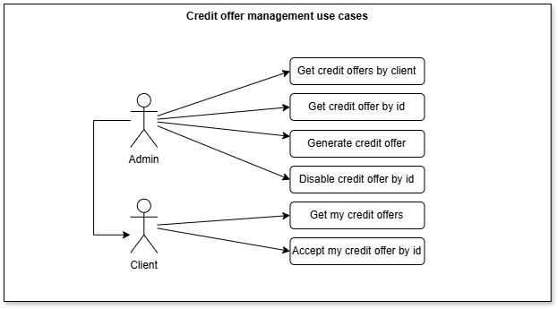
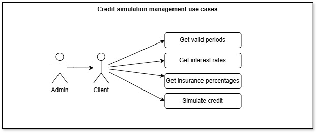
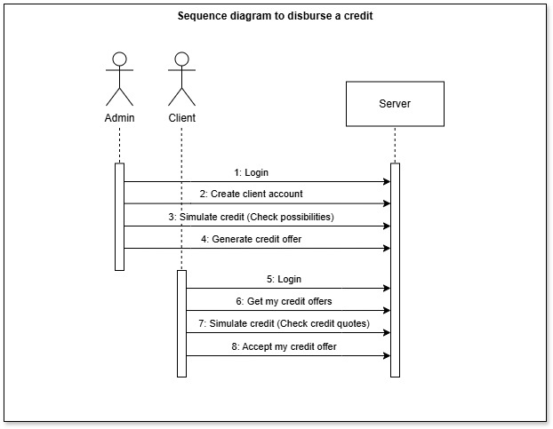

# Credit simulator API

System to manage credit simulations and credit offers. You can explore the sequence diagram below to understand the implemented credit disbursement process, which includes credit simulation, offer creation, and acceptance flow.

<details>
  <summary><b>Demo</b></summary>
<br>

You can try out a demo of the API [here](https://continued-petronella-adoptame-53ba5f62.koyeb.app/docs).

To access the demo, use `/auth/login` with the following credentials:
```json
{
  "username": "admin",
  "password": "ABC#abc#123"
}
```
```json
{
  "username": "client_1",
  "password": "ABC#abc#123"
}
```

You can use the Swagger Bearer authentication by clicking `Authorize` to enter the token generated from the `/auth/login` endpoint. Once you have authenticated with the token, you can automatically test all endpoints that the user has access to.

</details>

## Project Setup

<details>
  <summary>See the steps to configure and run the project</summary>
<br>

1. **Install Node.js, Git, and Npm:**

    Download and install **Node.js** (preferably version 22 to ensure compatibility) from the official website: [https://nodejs.org/en](https://nodejs.org/en). Verify the installation by running:

    ```bash
    node --version
    ```

    Download and install **Git** from the official website: [https://git-scm.com](https://git-scm.com). Verify the installation by running:

    ```bash
    git --version
    ```

    **Npm** is installed automatically with Node.js. Verify the installation by running:

    ```bash
    npm --version
    ```

2. **Clone the project and switch to the `develop` branch:**

    Run the following commands to clone the repository and checkout the `develop` branch:

    ```bash
    git clone https://github.com/cerciber/credit-simulator.git
    cd credit-simulator
    git checkout develop
    ```

3. **Install dependencies:**

    Run the following command to install all project dependencies:

    ```bash
    npm install
    ```

4. **Create configuration file:**

    Create a file named `.env.development` in the root of the project with the following content:

    ```bash
    # PORT: Port number on which the application will listen for incoming requests
    PORT=
    # MONGO_URI: Connection string for MongoDB. Includes the database server address, port, and authentication details if required.
    MONGO_URI=
    # JWT_SECRET_KEY: Key used for signing and verifying JSON Web Tokens (JWTs). Ensure this key is strong, unique, and kept confidential.
    JWT_SECRET_KEY=
    ```

5. **Create sample data (Only if you want to use your own database):**

    If you need reset database and set sample data, you can easily do so by running the following command:

    ```bash
    npm run db:reset
    ```

6. **Install VSC extensions (Optional for Visual Studio Code) :**

    You can install the required VS Code extensions by running the following commands:

    ```bash
    code --install-extension dbaeumer.vscode-eslint
    code --install-extension rvest.vs-code-prettier-eslint
    ```

    Alternatively, you can install these extensions `Prettier ESlint` and `ESlint` manually from the VS Code marketplace.

    To ensure that the configurations are applied correctly, restart Visual Studio Code.
<br>

7. **Run the project in development mode:**

    Navigate to the project directory and run the following command to start the project in development mode:

    ```bash
    npm run start:dev
    ```

    This will start the project with the development configuration. 
    
    You can view the documentation at `http://localhost:<PORT>/docs`, where `<PORT>` is the port specified in your `.env.development` file.

</details>

## Architecture

<details>
  <summary>See the architecture</summary>
<br>

<details> 
  <br>
  <summary>General architecture</summary>

  

  The general architecture include a **Server** that interacts with the **Client** through a **RESTful API**. The microservice is built using Node.js (TypeScript) with the Nest.js framework, following best practices for modularity and scalability.

  The **Server** communicates with a **DB**, a mongo database, using **Mongoose** as the ORM to handle data modeling and interactions.

</details>

<details>
  <br>
  <summary>Structure</summary>

  

  You can see the project's file and directory structure, designed to maintain a modular organization and facilitate code development and maintenance. The concepts are described below.

  - **Git customs**: Husky for managing Git hooks and ensuring code quality before commits.
  - **Workspace customs**: VSCode settings for consistent development environment configuration.
  - **Packages**: Dependencies and libraries managed via `package.json`.
  - **Logs**: Application logging files.
  - **Test**: Contains automated tests for verifying application functionality.
  - **Build**: Build scripts and output directories for compiled code.
  - **General configs**: Configuration files and global settings.
  - **Core module**: The root module of the application.
    - **Common**: Shared utilities and components used across the application.
      - **Statics**: Static files like codes, constants, docs, meesages and paths.
      - **Scripts**: Utility scripts.
      - **Decorators**: Custom decorators used to extend functionality.
      - **Exceptions**: Custom exception classes for error handling.
      - **Functions**: Utility functions and helpers.
      - **Interceptors**: Request and response interceptors for modifying or handling data.
    - **Dto's**: Data Transfer Objects for validating and transforming data.
    - **Services**: Business logic and service layer handling data processing.
    - **Module**: `app.module.ts` - The root module of the application.
    - **Main**: `main.ts` - The entry point of the application, bootstrapping the NestJS app.
    - **Modules**: Specific modules that encapsulate related controllers, services, and DTOs.

  

  You can see the general file and directory structure for submodules and the recommended flow to maintain a modular architecture. The concepts are described below.

  - **Dto's**: Data Transfer Objects for validating and transforming data.
  - **Controller**: Manages incoming requests, processes them, and returns appropriate responses.
  - **Services**: Business logic and service layer handling data processing and interactions with the database.
  - **Module**: `submodule-name.module.ts` - Defines the module configuration, imports necessary components, and sets up dependencies.
  - **Sub-Modules**: Specific sub-modules that encapsulate related controllers, services, and DTOs, allowing for organized and modular code.
  - **Schema**: Defines the data structure and validation rules for MongoDB collections, used for database interactions. It is not part of the submodule structure but is centralized in the specific MongoDB module.

</details>

<details>
  <br>
  <summary>Data Model</summary>

  

  The NoSQL database features Accounts and Credit Offers, incorporating relations, types, descriptions and basic constraints.

</details>

<details>
  <br>
  <summary>Components diagram</summary>

  

  The components diagram illustrates the interactions between the different components of the system.

</details>

<details>
  <br>
  <summary>Use Cases</summary>

  

  The **Auth use cases** illustrates the interactions between an user and the system for managing user auth. The user can perform the following actions:

  - **Login**: Authenticate user on the system.

  

  The **Accounts Management use cases** illustrates the interactions between an user and the system for managing user accounts. The user can perform the following actions:

  - **Get accounts**: Retrieve a list of all accounts.
  - **Get account by id**: Retrieve a specific account by its ID.
  - **Create account**: Create a new account.
  - **Update account by id**: Modify an existing account by its ID.
  - **Delete account by id**: Remove an existing account by its ID.

  

  The **Credit Offer Management use cases** illustrates the interactions between an user and the system for managing credit offers. The user can perform the following actions:

  - **Get credit offers by client**: Retrieve a list of all credit offers by client.
  - **Get credit offer by id**: Retrieve a specific credit offer by its ID.
  - **Create credit offer**: Create a new credit offer.
  - **Disable credit offer by id**: Disable an existing credit offer by its ID.
  - **Get my credit offers**: Retrieve a list of all credit offers by the current user.
  - **Accept my credit offer by id**: Accept an existing credit offer of the current user by its ID.

  

  The **Credit Simulation Management use cases** illustrates the interactions between an user and the system for managing credit simulations. The user can perform the following actions:

  - **Get valid periods**: Retrieve a list of all valid periods.
  - **Get interest rates**: Retrieve a list of all interest rates.
  - **Get insurance percentages**: Retrieve a list of all insurance percentages.
  - **Simulate credit**: Simulate a credit.

</details>

<details>
  <br>
  <summary>Sequence diagram to disburse a credit</summary>

  

  The sequence diagram shows the chronological flow of messages and interactions between system components during the credit disbursement process.
  
</details>

</details>

## Contribution Guidelines

<details>
  <summary>See Contribution Guidelines</summary>
  <br>

<details>
  <summary>Git Branching Strategy</summary>
  <br>

  The Git branching strategy ensures a structured and predictable workflow, facilitating continuous integration and easy management of releases and fixes. Below are the main branches and their specific purposes in the project:

  #### `main`
  Contains stable, production-ready code. All final releases are made from this branch.

  #### `develop`
  Integration branch for ongoing development. All new features and improvements are merged here before being released.

  #### `deploy`
  Used to prepare and deploy code to staging or production environments. Derived from `develop` or `main`.

  #### `fix/issue-xxxx`
  Dedicated branch for urgent bug fixes. Based on `main`, it’s used to resolve critical issues that need immediate attention.

  #### `feature/issue-xxxx`
  Individual branches for developing new features or resolving specific issues, derived from `develop`. Named according to the related issue number (`issue-xxxx`).

</details>

<details>
  <summary>Conventional Commits</summary>
  <br>

  Use this format for commit messages:

  #### **Type**
  - **`feat`**: New feature
  - **`fix`**: Bug fix
  - **`docs`**: Documentation update
  - **`style`**: Code formatting
  - **`refactor`**: Code change without adding features or fixing bugs
  - **`test`**: Adding or updating tests
  - **`chore`**: Maintenance tasks

  #### **Scope**
  - Optional: Identifies the part of the code affected (e.g., `auth`, `api`, `ui`).

  #### **Content**
  - Brief, imperative summary of the change.

  #### Examples

  - **Feature**: `feat(ui): add dark mode toggle`
  - **Bug Fix**: `fix(api): handle null values`
  - **Docs**: `docs(readme): update setup guide`

</details>

<details>
  <summary>Contribution Guide</summary>
  <br>

  This guide outlines the steps to effectively contribute to the project. By following these instructions, we ensure consistent quality, clear communication, and smooth collaboration among team members.

  ##### 1. Create an Issue
  - **Title**: Clearly describe the issue or feature.
  - **Details**: Add any relevant information or context.

  ##### 2. Branching
  - **From**: Always branch from `develop`.
  - **Branch Name**: Use `feature/issue-xxxx` (replace `xxxx` with the issue number).

  ##### 3. Development
  - **Code**: Implement the changes in your branch.
  - **Commits**: Follow the Conventional Commits guidelines.

  ##### 4. Pull Request
  - **PR Title**: Match the issue title.
  - **Description**: Briefly explain the changes.
  - **Target Branch**: Always target `develop`.

  ##### 5. Assign Reviewers
  - **Reviewers**: Assign at least two team members for review.
  - **Labels**: Add relevant labels (e.g., `bug`, `enhancement`).

  ##### 6. Address Feedback
  - **Revisions**: Make changes based on reviewer feedback.
  - **Final Check**: Ensure all comments are addressed before merging.

  ##### 7. Merge
  - **Approval**: At least one team member must approve the pull request before it can be merged.
  - **Merge**: Once approved, merge the PR into `develop`.
  - **Delete Branch**: Clean up by deleting the feature branch.

</details>

</details>